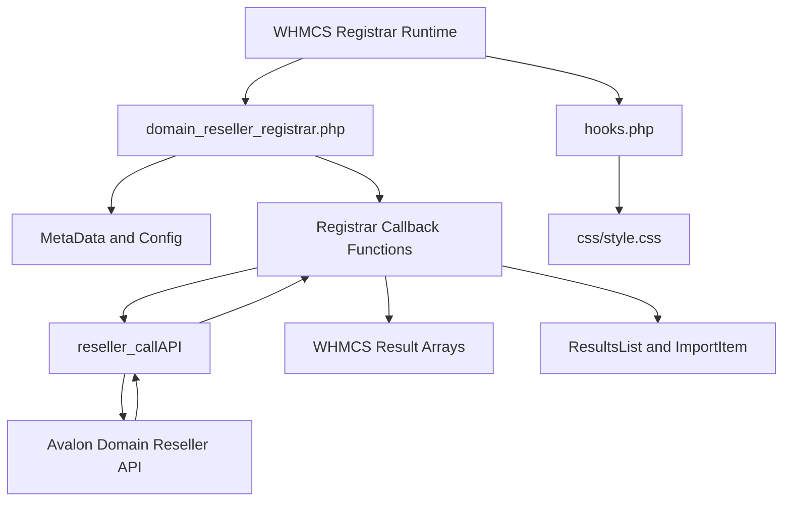
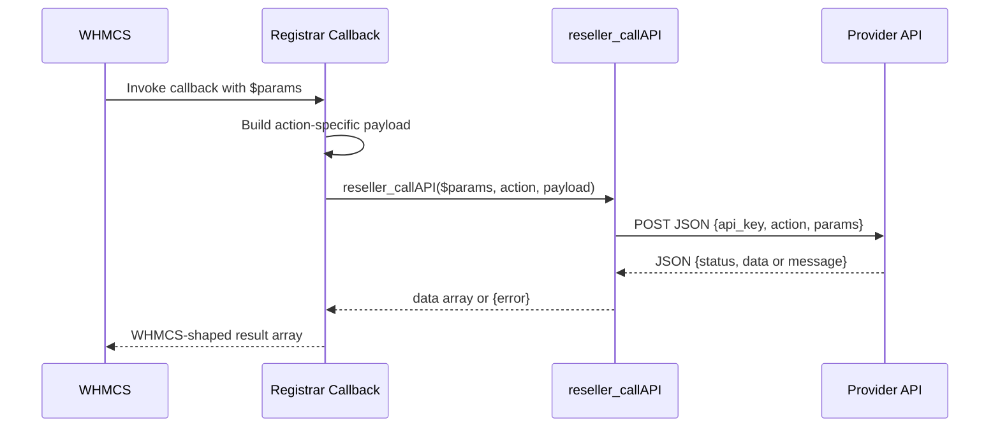

This module is intentionally small. Almost all of the behavior lives in `modules/registrars/domain_reseller_registrar/domain_reseller_registrar.php`, while `modules/registrars/domain_reseller_registrar/hooks.php` injects a small admin stylesheet and `modules/registrars/domain_reseller_registrar/css/style.css` disables specific contact inputs in the WHMCS admin UI. That single-file design matches how WHMCS registrar modules are discovered: callback names, not classes or service containers, are the integration contract.

## Design Decisions

### One procedural entrypoint

The source defines every public callback as a top-level function in `domain_reseller_registrar.php`. That is not accidental; WHMCS looks for names like `domain_reseller_registrar_RegisterDomain()` and `domain_reseller_registrar_Sync()`. A class-based wrapper would still need this procedural shell, so the repository keeps the surface direct and predictable.

### Shared transport helper

Every remote operation eventually calls `reseller_callAPI($params, $action, $apiParams = [])`. The helper assembles the JSON envelope with `api_key`, `action`, and `params`, sets a 60-second cURL timeout, and logs the decoded response with `logModuleCall()` when `moduleLog` is enabled. That decision keeps the provider API contract centralized instead of duplicating request logic across eighteen callbacks.

### Selective normalization, not full abstraction

Some callbacks build explicit request payloads. `RegisterDomain`, `TransferDomain`, `SaveNameservers`, `SaveContactDetails`, `Sync`, `TransferSync`, and `GetTldPricing` all reshape data before sending it upstream. Others such as `GetDNS`, `SaveDNS`, `RegisterNameserver`, and `GetDomainSuggestions` forward the full WHMCS `$params` array directly. The pattern reflects the source code: normalize where WHMCS and the provider clearly disagree, pass through where the upstream contract is expected to understand WHMCS-native fields already.

### WHMCS-native pricing import

`domain_reseller_registrar_GetTldPricing()` is the one place where the module does more than simple translation. It queries the default WHMCS currency using `Capsule::table('tblcurrencies')->where('default', 1)->first()`, requests pricing for that currency, then converts provider pricing maps into `WHMCS\Domain\TopLevel\ImportItem` instances inside a `WHMCS\Results\ResultsList`. That makes the function fit WHMCS's import pipeline instead of exposing raw provider JSON.

## Request Lifecycle

The typical lifecycle is:

The callback layer exists because WHMCS expects different return shapes for different operations. `GetNameservers()` must return `ns1` through `ns5`; `GetEPPCode()` must return `eppcode`; `TransferSync()` must always return `completed`, `failed`, `expirydate`, and `reason`; `GetTldPricing()` must return a `ResultsList`. The helper cannot collapse those differences away, so each callback performs a final mapping step after the HTTP response is decoded.

## How the Pieces Fit Together

`domain_reseller_registrar_MetaData()` and `domain_reseller_registrar_getConfigArray()` establish the module identity and configuration surface first. Once activated, WHMCS calls individual callbacks when an admin or automation task performs a registrar action. The callback creates a provider-facing payload, usually from the incoming `$params` array. The helper posts the payload to the configured endpoint, then returns either `data` or `error`. Finally, the callback returns the shape that WHMCS requires for that operation.

The admin hook is independent of the network path. `hooks.php` registers `AdminAreaHeaderOutput`, computes the relative URL for `css/style.css`, and injects a `<link>` element. The stylesheet disables certain `Contact Id` inputs inside the admin contact editor. That is a narrow but deliberate UI safeguard: the module assumes those fields are provider-managed and should not be edited freely.

## Source-Driven Constraints

- `reseller_callAPI()` captures `$httpCode` but never uses it. A `500` response with valid JSON is handled entirely by the decoded `status` field, so your provider endpoint must send well-formed JSON even for failures.
- `RegisterDomain()` and `TransferDomain()` pass the full `$params` array as the `registrant` contact. If your upstream API expects a reduced registrant schema, your provider implementation must ignore WHMCS-specific extras.
- `GetContactDetails()` accepts both `Technical` and `Tech` in provider responses, which is useful for compatibility but means downstream systems should pick one naming convention and stick to it.
- `GetTldPricing()` skips TLDs where the one-year register price is missing or non-positive. If a provider returns only multi-year pricing, that TLD will not be imported.

From here, the most useful follow-ups are [Registrar Callback Lifecycle](/docs/registrar-callback-lifecycle), [Provider API Transport](/docs/provider-api-transport), and [Sync and Pricing Import](/docs/sync-and-pricing).
