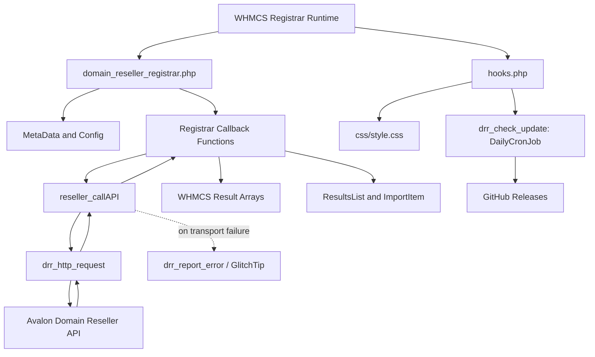
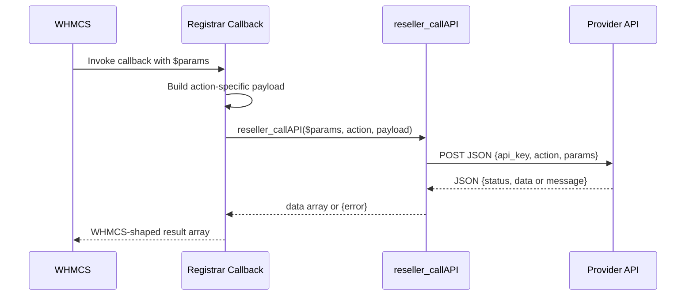

This module is intentionally small. Almost all of the WHMCS-facing behavior lives in `modules/registrars/domain_reseller_registrar/domain_reseller_registrar.php`, while `modules/registrars/domain_reseller_registrar/hooks.php` handles everything that isn't a registrar callback: injecting the admin stylesheet, and running the daily self-update check. That single-file design matches how WHMCS registrar modules are discovered: callback names, not classes or service containers, are the integration contract.

## Design Decisions

### One procedural entrypoint

The source defines every public callback as a top-level function in `domain_reseller_registrar.php`. That is not accidental; WHMCS looks for names like `domain_reseller_registrar_RegisterDomain()` and `domain_reseller_registrar_Sync()`. A class-based wrapper would still need this procedural shell, so the repository keeps the surface direct and predictable.

### Shared transport helper

Every remote operation eventually calls `reseller_callAPI($params, $action, $apiParams = [])`. The helper assembles the JSON envelope with `api_key`, `action`, a best-effort `locale`, and `params`; posts it through `drr_http_request()` (a thin `curl_setopt_array()` wrapper, 60-second timeout); and logs the decoded response with `logModuleCall()` when `moduleLog` is enabled. A request is retried once, but only when it never reached the provider at all (DNS/connect failure) — never on a timeout mid-request or any response actually received, since register/transfer/renew aren't safe to resend blind. `drr_http_request()` is also what GlitchTip error reporting and the GitHub self-update calls go through, so there is exactly one network seam in the whole module. That decision keeps the provider API contract centralized instead of duplicating request logic across eighteen callbacks.

`Sync` and `TransferSync` are the one exception: their response has no `status`/`data` envelope at all (a flat object, HTTP 200 whether the sync succeeded or not), so `reseller_callAPI` special-cases those two actions and hands the decoded body straight back instead of forcing it through the enveloped-response branch.

### Selective normalization, not full abstraction

Some callbacks build explicit request payloads. `RegisterDomain`, `TransferDomain`, `SaveNameservers`, `SaveContactDetails`, `Sync`, `TransferSync`, and `GetTldPricing` all reshape data before sending it upstream. Others such as `GetDNS`, `SaveDNS`, `RegisterNameserver`, and `GetDomainSuggestions` forward the full WHMCS `$params` array directly. The pattern reflects the source code: normalize where WHMCS and the provider clearly disagree, pass through where the upstream contract is expected to understand WHMCS-native fields already.

### WHMCS-native pricing import

`domain_reseller_registrar_GetTldPricing()` is the one place where the module does more than simple translation. It queries the default WHMCS currency using `Capsule::table('tblcurrencies')->where('default', 1)->first()`, requests pricing for that currency, then converts provider pricing maps into `WHMCS\Domain\TopLevel\ImportItem` instances inside a `WHMCS\Results\ResultsList`. That makes the function fit WHMCS's import pipeline instead of exposing raw provider JSON. It also absorbs a couple of provider quirks along the way — TLD keys arrive with a leading dot (`.com`) and pricing years are keyed as plain numbers (`"1"`, not `"1yr"`) — see [Importing TLD Pricing](/docs/guides/importing-tld-pricing).

### Self-update is deliberately not provider-controlled

`hooks.php`'s `drr_check_update()` runs on WHMCS's `DailyCronJob` hook and checks this repository's **GitHub Releases**, not the reseller API — a separate, independently-versioned distribution channel, so a misbehaving or compromised API endpoint can never push arbitrary code into an install. It verifies the downloaded release package against a published SHA-256 checksum before extracting anything, and can be turned off per install via the "Automatic Updates" config field. See [Hooks and Assets](/docs/api-reference/hooks-and-assets).

## Request Lifecycle

The typical lifecycle is:

The callback layer exists because WHMCS expects different return shapes for different operations. `GetNameservers()` must return `ns1` through `ns5`; `GetEPPCode()` must return `eppcode`; `TransferSync()` must always return `completed`, `failed`, `expirydate`, and `reason`; `GetTldPricing()` must return a `ResultsList`. The helper cannot collapse those differences away, so each callback performs a final mapping step after the HTTP response is decoded.

## How the Pieces Fit Together

`domain_reseller_registrar_MetaData()` and `domain_reseller_registrar_getConfigArray()` establish the module identity and configuration surface first. Once activated, WHMCS calls individual callbacks when an admin or automation task performs a registrar action. The callback creates a provider-facing payload, usually from the incoming `$params` array. The helper posts the payload to the configured endpoint, then returns either `data` or `error`. Finally, the callback returns the shape that WHMCS requires for that operation.

The admin hook is independent of the network path. `hooks.php` registers `AdminAreaHeaderOutput`, computes the relative URL for `css/style.css`, and injects a `<link>` element. The stylesheet disables certain `Contact Id` inputs inside the admin contact editor. That is a narrow but deliberate UI safeguard: the module assumes those fields are provider-managed and should not be edited freely.

## Source-Driven Constraints

- `reseller_callAPI()` does use `$httpCode` — but not the way you might expect. Every business error the provider sends (redemption period, insufficient balance, etc.) is documented to arrive as **non-2xx**, so HTTP status alone can't tell "expected business error" apart from "genuine provider/transport failure". The module instead checks whether the body is a well-formed `{"status":"error","message":"..."}` shape: if it is, the non-2xx status is treated as an expected business outcome (not reported to GlitchTip); if it isn't, it's treated as an anomaly worth reporting.
- `RegisterDomain()` and `TransferDomain()` do **not** send a `contacts` object — the provider pulls WHOIS/contact data from the reseller's own account, not from the registering client's WHMCS profile. They do send `nameservers` (up to 5, from the values chosen at checkout).
- `GetContactDetails()` accepts both `Technical` and `Tech` in provider responses, and reads the provider's real field names first (WHMCS's own space-separated WHOIS format — `"First Name"`, `"Email Address"`, `"Phone Number"`, `"Postcode"`), with underscored/alternate spellings kept only as fallbacks.
- `GetTldPricing()` skips TLDs where the one-year register price is missing or non-positive. If a provider returns only multi-year pricing, that TLD will not be imported. Every imported TLD defaults to EPP-required, since the provider currently has no per-TLD signal that says otherwise.

From here, the most useful follow-ups are [Registrar Callback Lifecycle](/docs/registrar-callback-lifecycle), [Provider API Transport](/docs/provider-api-transport), and [Sync and Pricing Import](/docs/sync-and-pricing).
