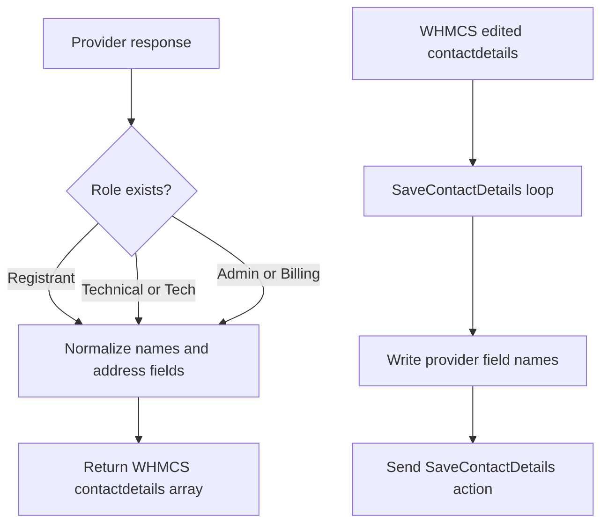

Contact data is where this module performs the most explicit schema translation. WHMCS wants human-readable contact arrays for domain contact editing. The provider's `GetContactDetails` response is a direct passthrough of WHMCS's own `DomainGetWhoisInfo` command, so it actually arrives using WHMCS's own space-separated field names already (`"First Name"`, `"Email Address"`, `"Phone Number"`, `"Postcode"`, `"Tech"` for the technical contact) — but the module still normalizes defensively, falling back to underscored/alternate spellings (`Full_Name`, `Address_1`, `Phone_Number`, `Technical`) in case a different backend varies.

## Why This Exists

Without normalization, you end up with inconsistent field names, missing address lines, or broken contact editing screens. `domain_reseller_registrar_GetContactDetails()` and `domain_reseller_registrar_SaveContactDetails()` solve that by converting between the provider's raw payloads and the WHMCS-friendly structure used by registrar callbacks.

This concept is tightly connected to:

- [Provider API Transport](/docs/provider-api-transport), because contact payloads are sent and received through the standard JSON envelope.
- [Registrar Callback Lifecycle](/docs/registrar-callback-lifecycle), because the contact callbacks still have to return WHMCS-shaped arrays.

## Internal Walkthrough

`GetContactDetails()` calls the provider action `GetContactDetails` with only `domainid` and `domainname`. Once it receives `data`, it inspects these possible keys:

- `Registrant`
- `Billing`
- `Technical`
- `Tech`
- `Admin`

Each section is normalized by one shared helper, `drr_normalize_contact()`, into WHMCS keys such as:

- `Company Name`
- `First Name`
- `Last Name`
- `Address 1`
- `Address 2`
- `Email`
- `City`
- `State`
- `Zip`
- `Country`
- `Phone`

For each of those, the helper checks the provider's real (space-separated) field name first — `"Company Name"`, `"First Name"`/`"Last Name"`, `"Address 1"`/`"Address 2"`, `"Email Address"`, `"Postcode"`, `"Phone Number"` — falling back to underscored/alternate spellings (`Company_Name`, `Address_1`, `Zip`, bare `Email`/`Phone`, …) only if the space-separated key is absent. If neither `First Name` nor `Last Name` is present but `Full_Name` is, the helper splits it on spaces and uses the first token as `First Name` and the last token as `Last Name`.

`SaveContactDetails()` performs the inverse mapping. It loops over `$params['contactdetails']`, then writes provider-facing keys like `First_Name`, `Last_Name`, `Company_Name`, `Address_1`, and `Phone` — this is the one direction where the module still uses underscored keys by default, since the provider's `SaveContactDetails` action accepts either style interchangeably.



## Basic Usage Example

A provider response looks like this (WHMCS's own WHOIS-info field names):

```json
{
  "status": "success",
  "data": {
    "Registrant": {
      "First Name": "John",
      "Last Name": "Doe",
      "Email Address": "john@example.com",
      "Address 1": "123 Main Street",
      "City": "Austin",
      "State": "TX",
      "Postcode": "78701",
      "Country": "US",
      "Phone Number": "+15125550123"
    }
  }
}
```

The module converts that into:

```php
[
    'Registrant' => [
        'Company Name' => '',
        'First Name' => 'John',
        'Last Name' => 'Doe',
        'Address 1' => '123 Main Street',
        'Address 2' => '',
        'Email' => 'john@example.com',
        'City' => 'Austin',
        'State' => 'TX',
        'Zip' => '78701',
        'Country' => 'US',
        'Phone' => '+15125550123',
    ],
]
```

## Advanced Example

If your upstream service expects provider-style keys on save, this is what the module sends:

```php
[
    'domainid' => 123,
    'domainname' => 'example.com',
    'contactdetails' => [
        'Technical' => [
            'First_Name' => 'Jane',
            'Last_Name' => 'Doe',
            'Company_Name' => 'Example Inc.',
            'Email' => 'jane@example.com',
            'Address_1' => '500 Congress Ave',
            'Address_2' => 'Suite 100',
            'City' => 'Austin',
            'State' => 'TX',
            'Zip' => '78701',
            'Country' => 'US',
            'Phone' => '+15125550124',
        ],
    ],
]
```

That means your provider API should not expect WHMCS labels like `First Name`; the module already normalized them before making the request.

<Callout type="warn">The `Full_Name` split is only a last-resort fallback, used when neither `"First Name"` nor `First_Name` is present. It is simple: multi-part surnames or single-word names will not be preserved perfectly, because the source takes the first token as first name and the last token as last name. The real provider API sends explicit `"First Name"`/`"Last Name"` already, so this path shouldn't normally be exercised in production.</Callout>

## Trade-Offs

<Accordions>
  <Accordion title="Flexible field fallbacks versus strict schemas">
    The module accepts several source field names for addresses and phone numbers, which makes integration with older or inconsistent provider payloads easier. That compatibility reduces breakage when upstream systems use `Address`, `Address1`, or `Address_1` interchangeably. The trade-off is that the exact canonical schema becomes less obvious over time, because multiple variants are silently accepted. For long-term maintainability, it is better to standardize your provider responses on one field naming scheme even though the module tolerates more than one.
  </Accordion>
  <Accordion title="Human-readable WHMCS keys versus provider-native keys">
    WHMCS contact arrays use labels such as `First Name` and `Address 1`, which are convenient for UI rendering and match the platform's expectations. Provider APIs often prefer machine-oriented keys like `First_Name` and `Address_1`. The module bridges that mismatch cleanly, but it means both representations exist in the codebase and in the docs. If you add new contact fields upstream, you need to update both directions of the mapping or the field will disappear during round-trips.
  </Accordion>
</Accordions>

## Source References

- `modules/registrars/domain_reseller_registrar/domain_reseller_registrar.php`
- `domain_reseller_registrar_GetContactDetails($params)`
- `domain_reseller_registrar_SaveContactDetails($params)`
- `modules/registrars/domain_reseller_registrar/css/style.css`

Continue with [Sync and Pricing Import](/docs/sync-and-pricing) for the two other places where the module performs more than a simple pass-through.
