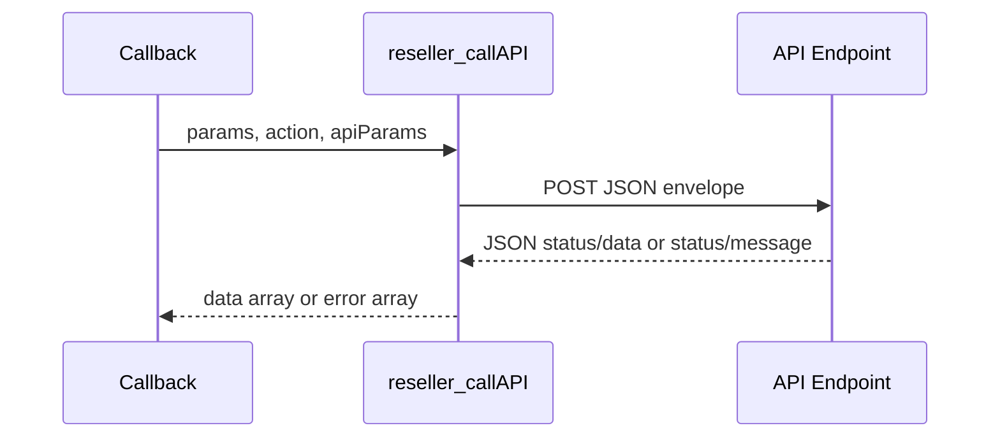

`reseller_callAPI()` is the transport layer for the entire registrar module. It lives in `modules/registrars/domain_reseller_registrar/domain_reseller_registrar.php` and is called by nearly every public callback. If you are implementing the upstream Avalon-compatible API, this is the function that defines what your endpoint must accept and return.

## What This Concept Is

The helper turns WHMCS callback data into a JSON POST request with a fixed envelope:

```json
{
  "api_key": "your_api_key",
  "action": "ActionName",
  "locale": "english",
  "params": {
    "domainid": 123,
    "domainname": "example.com"
  }
}
```

`locale` is a best-effort read of the current WHMCS client/admin language, sent so your API can optionally localize `message` text. Treat it as a hint, not a guarantee — WHMCS doesn't document a reliable source for it inside registrar-module callbacks.

It then expects a JSON response shaped like:

```json
{
  "status": "success",
  "data": {
    "anything": "action-specific"
  }
}
```

or

```json
{
  "status": "error",
  "message": "Human readable message",
  "error_code": "optional_machine_readable_code"
}
```

`error_code` is optional; the module passes it through unchanged on its own error return when present, but does not yet act on any particular value.

`Sync` and `TransferSync` are the exception to this envelope — see [Sync and Pricing Import](/docs/sync-and-pricing).

This concept exists so the module can keep WHMCS-facing code small while the provider API varies by action.

## How It Relates to Other Concepts

- The [Registrar Callback Lifecycle](/docs/registrar-callback-lifecycle) builds the action-specific payloads that are handed to this helper.
- [Contact Normalization](/docs/contact-normalization) happens before or after transport when raw payload fields do not match WHMCS naming.
- [Sync and Pricing Import](/docs/sync-and-pricing) relies on the transport helper but adds stricter post-processing rules on top of the decoded `data`.

## Internal Logic Walkthrough

The implementation does six concrete things:

1. Reads `customApiEndpoint`, `customApiKey`, and `moduleLog` from `$params`, and derives a best-effort `locale`.
2. POSTs JSON to the configured endpoint via `drr_http_request()` (a thin cURL wrapper shared with GlitchTip reporting and the self-update calls) with `Content-Type: application/json`.
3. Sends a body containing `api_key`, `action`, `locale`, and `params`.
4. Retries once, but only when the request never reached the provider at all (a connect/DNS-level cURL failure) — never on a timeout mid-request or any response actually received.
5. Decodes the JSON response into an associative array.
6. Returns `$decodedResponse['data']` for `status === 'success'`; for `Sync`/`TransferSync` returns the decoded body as-is (no envelope); otherwise returns `['error' => ..., 'details' => ..., 'error_code' => ...]`.

Important source details:

- Timeout is `60` seconds per attempt.
- `CURLOPT_FOLLOWLOCATION` is enabled.
- `logModuleCall()` receives the endpoint, action, request params, and decoded response only when `moduleLog` is truthy.
- `$httpCode` **is** used, but not as a simple success/failure switch: since the provider documents every business error as non-2xx, the module reports a non-2xx response to GlitchTip only when it *isn't* a well-formed `{"status":"error","message":"..."}` body — that's the signal for "something actually went wrong", not the HTTP status by itself.



## Basic Usage Example

A minimal provider endpoint in PHP can look like this:

```php
<?php

$request = json_decode(file_get_contents('php://input'), true);
$action = $request['action'] ?? '';

switch ($action) {
    case 'RenewDomain':
        echo json_encode([
            'status' => 'success',
            'data' => [
                'renewed' => true,
                'expirydate' => '2027-03-25',
            ],
        ]);
        break;

    default:
        echo json_encode([
            'status' => 'error',
            'message' => 'Unsupported action',
        ]);
}
```

## Advanced Example

A more defensive provider implementation should validate the API key, preserve JSON output on error, and support multiple actions:

```php
<?php

$request = json_decode(file_get_contents('php://input'), true);

if (($request['api_key'] ?? '') !== getenv('AVALON_API_KEY')) {
    http_response_code(401);
    echo json_encode([
        'status' => 'error',
        'message' => 'Invalid API key',
        'data' => ['code' => 'AUTH_FAILED'],
    ]);
    exit;
}

$handlers = [
    'GetNameservers' => function (array $params): array {
        return [
            'status' => 'success',
            'data' => [
                'ns1' => 'ns1.provider.net',
                'ns2' => 'ns2.provider.net',
                'ns3' => '',
                'ns4' => '',
                'ns5' => '',
            ],
        ];
    },
    'GetRegistrarLock' => function (array $params): array {
        return [
            'status' => 'success',
            'data' => ['lockenabled' => 'locked'],
        ];
    },
];

$action = $request['action'] ?? '';
$params = $request['params'] ?? [];

echo json_encode(($handlers[$action] ?? fn (): array => [
    'status' => 'error',
    'message' => 'Unknown action',
])($params));
```

<Callout type="warn">Your endpoint must always return valid JSON, even for failures. The module does not use the HTTP status code to decide success; it only checks whether the JSON decodes and whether the top-level `status` field equals `success`.</Callout>

## Trade-Offs

<Accordions>
  <Accordion title="Simple JSON envelope versus action-specific endpoints">
    A single endpoint with an `action` field is easy to wire into WHMCS because every callback can target the same configured URL. It also keeps credentials and logging behavior centralized. The trade-off is that your provider service becomes a command router, so validation and authorization have to branch on the `action` value. If your internal platform prefers REST-style resources, you may want a thin adapter service that converts this envelope into internal API calls.
  </Accordion>
  <Accordion title="Logging decoded payloads">
    When `moduleLog` is enabled, `logModuleCall()` records request and response data, which is extremely useful when debugging registrar flows inside WHMCS. The cost is that sensitive operational data can end up in WHMCS logs if you leave the option on permanently. Because the source logs decoded provider responses, make sure your upstream API does not echo secrets back in `data`. Turn logging on for diagnosis, then disable it again.
  </Accordion>
</Accordions>

## Source References

- `modules/registrars/domain_reseller_registrar/domain_reseller_registrar.php`
- `reseller_callAPI($params, $action, $apiParams = [])`
- `API.md`

Next, read [Contact Normalization](/docs/contact-normalization) if your provider stores contact records differently from WHMCS.
