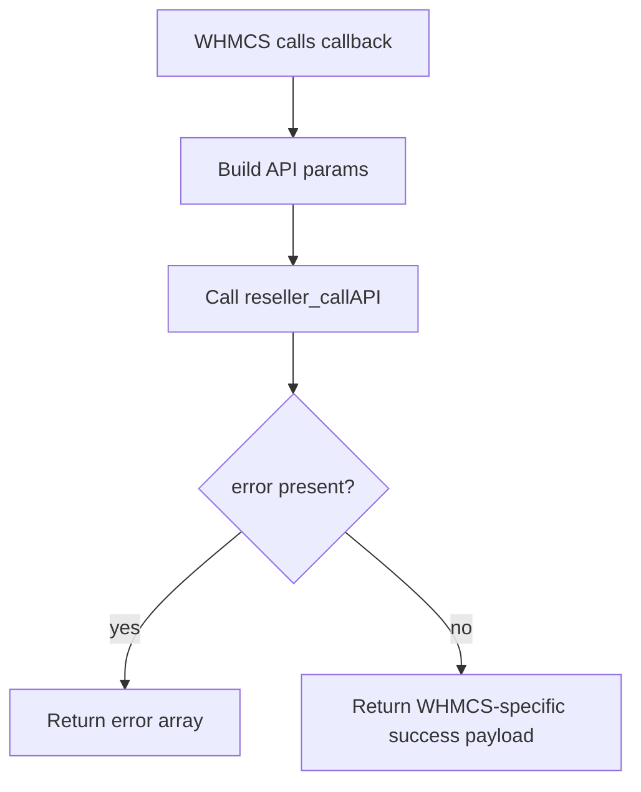

The central abstraction in this repository is not a class or SDK client. It is the WHMCS registrar callback. Every public operation is exposed as a function whose name starts with `domain_reseller_registrar_`, and WHMCS invokes those functions when an admin action or automation task needs registrar behavior.

## What This Concept Solves

WHMCS does not load registrar modules through dependency injection or modern package exports. It scans for a registrar module directory and calls functions with specific names. This module embraces that contract directly in `modules/registrars/domain_reseller_registrar/domain_reseller_registrar.php`, which keeps the runtime model simple and avoids hidden indirection.

This concept relates to:

- [Provider API Transport](/docs/provider-api-transport), because most callbacks delegate HTTP work to `reseller_callAPI()`.
- [Contact Normalization](/docs/contact-normalization), because contact-oriented callbacks reshape provider payloads before returning them.
- [Sync and Pricing Import](/docs/sync-and-pricing), because some callbacks must return WHMCS-native objects or lifecycle-specific arrays instead of plain success booleans.

## How It Works Internally

The file starts with two capability functions:

```php
function domain_reseller_registrar_MetaData()
function domain_reseller_registrar_getConfigArray()
```

These identify the registrar to WHMCS and declare its configurable fields. The operational callbacks follow. Some examples:

- `domain_reseller_registrar_RegisterDomain($params)` builds a payload with contact sections and feature flags, calls the provider action `RegisterDomain`, then returns either `['error' => ...]` or `['success' => true]`.
- `domain_reseller_registrar_GetNameservers($params)` asks the provider for nameservers, then guarantees a five-key result with `ns1` through `ns5`.
- `domain_reseller_registrar_TransferSync($params)` always returns the specific keys WHMCS expects for transfer polling, even on failure.

The file is organized by behavior, but the execution pattern is consistent:



That consistency is a real design feature. Once you understand one callback, the rest are easier to predict.

## Basic Usage Example

In practice, you do not call these functions directly from application code. You install the module and let WHMCS invoke them. The example below shows the effective contract for a registration request:

```php
<?php

function domain_reseller_registrar_RegisterDomain(array $params): array
{
    // WHMCS supplies $params. The module builds API params from it.
    // On success, WHMCS expects ['success' => true].
    // On failure, WHMCS expects ['error' => 'message'].
}
```

Typical WHMCS-supplied fields used by the source include:

```php
[
    'domainid' => 123,
    'domainname' => 'example.com',
    'regperiod' => 1,
    'dnsmanagement' => true,
    'emailforwarding' => false,
    'idprotection' => true,
    'adminfirstname' => 'John',
    'techfirstname' => 'Jane',
    'customApiEndpoint' => 'https://provider.example/api',
    'customApiKey' => 'secret',
]
```

## Advanced Example

`TransferSync` shows how callback-specific result shapes matter:

```php
<?php

function domain_reseller_registrar_TransferSync(array $params): array
{
    return [
        'completed' => true,
        'expirydate' => '2027-03-25',
        'failed' => false,
        'reason' => '',
        'error' => '',
    ];
}
```

That return shape is not optional. If your provider only returns `status: success`, the module still has to translate that into the polling fields WHMCS expects.

<Callout type="warn">Do not treat all callbacks as interchangeable success booleans. `GetNameservers`, `GetContactDetails`, `GetEPPCode`, `Sync`, `TransferSync`, and `GetTldPricing` each require a specific return schema, and returning the wrong keys will surface as broken WHMCS UI states rather than obvious PHP errors.</Callout>

## Trade-Offs

<Accordions>
  <Accordion title="Procedural callbacks instead of classes">
    WHMCS already defines the public entrypoint as a set of named functions, so the module keeps that structure explicit. The upside is clarity: when WHMCS needs `RegisterDomain`, there is exactly one function with that name and no bootstrapping layer to debug. The downside is testability and reuse, because there is no injected transport interface or service object. If you want stronger separation later, the pragmatic refactor is to keep these functions as thin wrappers and move internals into a helper class without changing the exported function names.
  </Accordion>
  <Accordion title="Uniform callback pattern across different operations">
    Nearly every function follows the same build-call-map pattern, which lowers maintenance cost and makes behavior predictable. That pattern also means callbacks with very different semantics are forced into a similar shape, even when some could benefit from stronger validation before the API call. For example, `SaveNameservers()` always forwards `ns1` through `ns5`, while `TransferDomain()` filters empty nameservers with `array_filter()`. Consistency wins here, but you should not assume the input hygiene is equally strict across all callbacks.
  </Accordion>
</Accordions>

## Source References

- `modules/registrars/domain_reseller_registrar/domain_reseller_registrar.php`
- `domain_reseller_registrar_MetaData()`
- `domain_reseller_registrar_getConfigArray()`
- `domain_reseller_registrar_RegisterDomain()`
- `domain_reseller_registrar_TransferSync()`

Continue with [Provider API Transport](/docs/provider-api-transport) to see how the callbacks speak to the upstream reseller platform.
