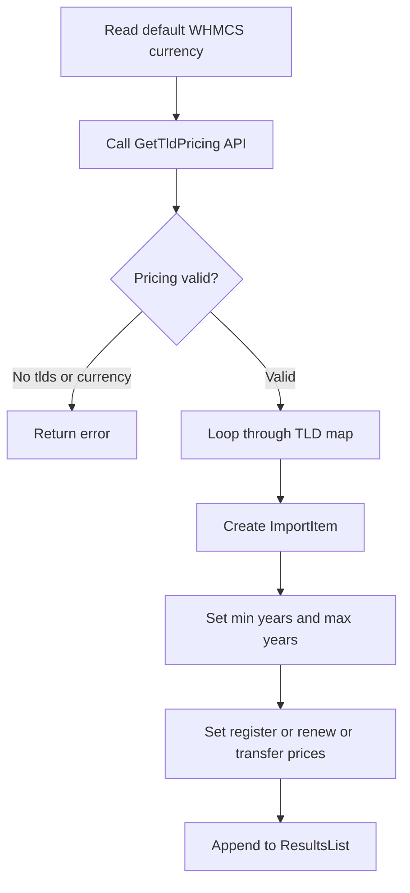

The `Sync`, `TransferSync`, and `GetTldPricing` callbacks are the most WHMCS-specific parts of the module. They do not just proxy provider API data. They translate provider status into polling fields and convert raw pricing maps into typed import records.

## What This Concept Covers

- `domain_reseller_registrar_Sync($params)`
- `domain_reseller_registrar_TransferSync($params)`
- `domain_reseller_registrar_GetTldPricing($params)`

These callbacks matter because WHMCS automation depends on them for lifecycle correctness. Registration dates, transfer completion, and price import behavior all become unreliable if the return shape is even slightly off.

## How It Works Internally

Unlike every other callback, `Sync` and `TransferSync` get a response from the provider with **no `status`/`data` envelope at all** — a flat JSON object, HTTP 200 whether the sync succeeded or not, with an `error` key that is always present (empty string on success). `reseller_callAPI()` special-cases both action names so it hands the decoded body straight back instead of forcing it through the enveloped-response logic that every other callback uses.

`Sync()` sends:

```php
[
    'domainid' => $params['domainid'],
    'domainname' => $params['domain'],
    'sld' => $params['sld'],
    'tld' => $params['tld'],
]
```

Then it converts the response into:

```php
[
    'active' => (bool) ($response['active'] ?? false),
    'cancelled' => (bool) ($response['cancelled'] ?? false),
    'transferredAway' => (bool) ($response['transferredAway'] ?? false),
    'expirydate' => $response['expirydate'] ?? '',
    'error' => $response['error'] ?? '',
]
```

`TransferSync()` is similar but returns `completed`, `failed`, `expirydate`, `reason`, and `error`. On transport failure, it still returns a fully populated failure-shaped array rather than a bare `error` key.

`GetTldPricing()` does more:

1. Looks up the default WHMCS currency from `tblcurrencies` through `Capsule`.
2. Sends that currency code upstream in the `GetTldPricing` action.
3. Reads `tlds` and `currency` from the provider response. The provider keys TLDs **with a leading dot** (`.com`) and pricing years as plain numbers (`"1"`, `"2"`) — the module strips the dot and accepts `"1yr"`-style keys only as a fallback.
4. Skips TLDs missing a positive one-year register price.
5. Builds `ImportItem` objects with register, renew, and transfer prices.
6. Detects custom year ranges and calls `setYears()` when year keys are not contiguous.
7. Marks every TLD as EPP-required by default — the provider's `tld_features` map currently reports addon enablement (`dnsmanagement`/`emailforwarding`/`idprotection`), not an EPP flag, so there's no live signal to say a TLD *doesn't* need one. An explicit `tld_features[tld].eppcode` value, if the provider ever sends one, overrides the default.
8. Returns a `ResultsList` collection.



## Basic Usage Example

A minimal sync response from your provider should look like:

```json
{
  "status": "success",
  "data": {
    "active": true,
    "cancelled": false,
    "transferredAway": false,
    "expirydate": "2027-03-25"
  }
}
```

That lets the module return the exact fields WHMCS expects during registrar sync.

## Advanced Example

A pricing response with custom year ranges can look like:

```json
{
  "status": "success",
  "data": {
    "currency": { "id": 1, "code": "USD", "prefix": "$", "suffix": "" },
    "tlds": {
      ".com": {
        "register": { "1": 10.99, "2": 20.50, "5": 49.00 },
        "renew": { "1": 11.99, "2": 22.50, "5": 54.00 },
        "transfer": { "1": 9.99 }
      }
    },
    "tld_features": {
      ".com": { "dnsmanagement": true, "emailforwarding": true, "idprotection": true }
    }
  }
}
```

The module will detect the non-contiguous years `1`, `2`, and `5`, set `minYears` to `1`, `maxYears` to `5`, and call `setYears([1, 2, 5])` on the generated `ImportItem`. That preserves the provider's real sales windows instead of assuming every year in the range is available. The imported `.com` item is also marked EPP-required by default, since this `tld_features` entry doesn't say otherwise.

<Callout type="warn">`GetTldPricing()` drops any TLD that does not have a positive year-1 register price (checked as `register["1"]`, falling back to `register["1yr"]`). If your provider only sells a TLD in longer terms, WHMCS will not import it with the current implementation.</Callout>

## Trade-Offs

<Accordions>
  <Accordion title="Provider flexibility versus strict WHMCS sync contracts">
    The provider is allowed to expose its own internal logic and state model, but the module has to compress that state into the limited fields WHMCS understands. That works well when the provider can answer simple questions such as active versus cancelled or completed versus failed. It is less expressive when a transfer has intermediate states or registry-specific outcomes that WHMCS cannot model directly. In those cases, use the `reason` field in `TransferSync()` responses to preserve detail for operators.
  </Accordion>
  <Accordion title="Dynamic pricing import versus minimal validation">
    The pricing importer does useful work by deriving available year ranges, carrying over renew and transfer pricing, and producing real `ImportItem` objects. At the same time, the validation is intentionally lightweight: it only requires a usable currency object and a positive one-year register price. That keeps the module tolerant of provider differences, but it also means malformed year keys or inconsistent price matrices may pass through partially. If pricing integrity is critical, validate your provider response before the module ever sees it.
  </Accordion>
</Accordions>

## Source References

- `modules/registrars/domain_reseller_registrar/domain_reseller_registrar.php`
- `domain_reseller_registrar_Sync($params)`
- `domain_reseller_registrar_TransferSync($params)`
- `domain_reseller_registrar_GetTldPricing($params)`

For runnable setup instructions, continue with the guides section.
